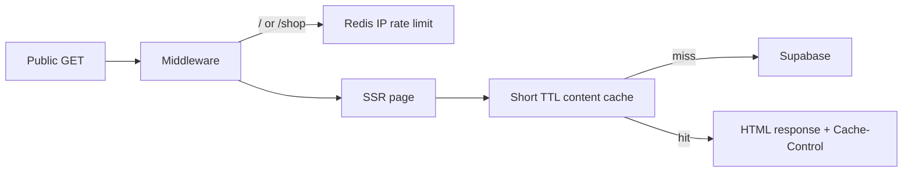

# Phased Implementation Plan: Landing Page DDoS Mitigations

> **Guiding Strategy:** Reduce amplification first, then cache expensive reads, then rate-limit hot paths, then harden at the edge.  
> **Status:** Completed 2026-07-26  
> **Scope:** Cache marketing pages (`/`, `/our-story`, `/contact`, `/business`); rate-limit GETs on `/` and `/shop` only.

---

## Background

A security review of the public landing surface found:

| Area | Finding |
|------|---------|
| Network DDoS | Mitigated by Cloudflare Workers platform (Worker `jehmarp` on workers.dev). |
| Application-layer abuse | **High risk** — marketing pages use SSR (`output: "server"`) with Supabase reads on every GET and no edge cache. |
| Middleware | No GET rate limiting today; only load-error handling. |
| Prefetch | `prefetchAll: true` can multiply SSR/DB work when users land on home. |
| POST endpoints | Guest order, contact, reseller flows already use Turnstile + Redis/DB rate limits. |
| Edge WAF | Custom domain not attached to Worker; zone WAF/Bot Fight not applied to workers.dev hostname. |

---

## Phase 1 — Narrow prefetch amplification ✅

**Goal:** Stop one landing visit from prefetching every public SSR route.

**Files:** [`web/astro.config.mjs`](../../web/astro.config.mjs)

- [x] Change `prefetch.prefetchAll: true` → `false` (keep `defaultStrategy: 'hover'`).
- [x] Run `npm run check` and confirm public nav still works.
- [x] Confirm home load does not mass-prefetch `/shop` and other public routes.

---

## Phase 2 — Short-TTL marketing content + response caching ✅

**Goal:** Cut Supabase load for mostly-static marketing GETs.

### Data cache helpers

**Files:** [`web/src/lib/public-website/content-cache.ts`](../../web/src/lib/public-website/content-cache.ts), [`web/src/lib/public-website/content.ts`](../../web/src/lib/public-website/content.ts)

- [x] Add `getCachedJson` / `setCachedJson` using Cloudflare `caches.default` when available.
- [x] Add in-process TTL fallback for local/dev/tests.
- [x] Set TTL to **60 seconds** for page content and featured products.
- [x] Wrap `getPublicPageContent` with cache key `public-page:{slug}`.
- [x] Wrap `getFeaturedPublicProducts` with cache key `public-featured-products:{limit}`.
- [x] Add unit tests for cache hit/miss and TTL keying.

### Response headers

**Middleware:** [`web/src/middleware.ts`](../../web/src/middleware.ts), [`web/src/lib/public-website/marketing-page-response.ts`](../../web/src/lib/public-website/marketing-page-response.ts)

- [x] Add helper to set `Cache-Control: public, s-maxage=60, stale-while-revalidate=300` on marketing GET responses.
- [x] Use `no-store` (or skip cache header) when feedback query params exist: `?inquiry=`, `?application=`, `?order=`.

### Admin freshness

**Files:** [`web/src/lib/admin-dashboard/actions.ts`](../../web/src/lib/admin-dashboard/actions.ts)

- [x] After successful `page_section` / page publish updates, best-effort delete matching cache keys.

---

## Phase 3 — GET rate limit on `/` and `/shop` ✅

**Goal:** Bound expensive SSR paths per IP.

**Files:** [`web/src/middleware.ts`](../../web/src/middleware.ts), [`web/src/lib/security/public-get-rate-limit.ts`](../../web/src/lib/security/public-get-rate-limit.ts)

- [x] Apply rate limit to `GET`/`HEAD` when pathname is exactly `/` or `/shop`.
- [x] Skip authenticated `/admin/*` routes.
- [x] Reuse `enforceFixedWindowRateLimit` + `getClientIp` + Upstash env from `getServerEnv`.
- [x] Set limits to **120 requests / 60s / IP** with keys `public-get:home` and `public-get:shop`.
- [x] Fail-open when Redis is not configured (log/warn once).
- [x] Return `429` with `Retry-After` when Redis is configured and limit exceeded.
- [x] Add tests for allow / exceed / missing Redis behavior.

---

## Phase 4 — Ops: custom domain + Bot Fight (docs only) ✅

**Goal:** Platform protections the Worker hostname cannot get alone.

**Files:** [`contexts/runbooks/landing-ddos-edge-hardening.md`](../../contexts/runbooks/landing-ddos-edge-hardening.md), [`web/README.md`](../../web/README.md)

- [x] Document attaching a custom domain to Worker `jehmarp`.
- [x] Document enabling Bot Fight Mode / security level on that zone.
- [x] Document optional Cloudflare Rate Limiting rule mirroring Phase 3 as defense-in-depth.

---

## Out of scope (follow-ups)

- Full `/shop` product-catalog Redis/Cache snapshot (Phase 3 rate-limits `/shop`; catalog caching is a later PR).
- Changing POST form rate limits (already Turnstile + Redis).

---

## Implementation order

Ship phases **1 → 2 → 3 → 4** sequentially; each phase is independently reviewable and testable.
