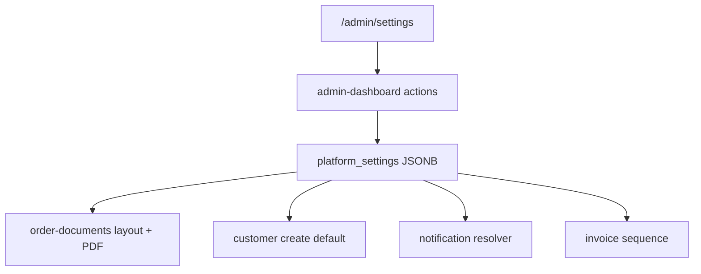

# Phased Implementation Plan: Admin Settings

> **Guiding Strategy:** Foundation first → identity & documents → operational defaults → notifications → numbering → later catalog/security.  
> **Status:** Phases 0–6 complete (2026-07-27)  
> **Scope:** Admin `/admin/settings` only; agent settings stays out of scope except password-reset support actions.

---

## Background

Admin Settings today is a placeholder. Operational values that should be business-owned are hardcoded in app code or missing entirely.

| Area | Current state |
|------|---------------|
| Settings page | Live at [`web/src/pages/admin/settings.astro`](../../web/src/pages/admin/settings.astro) — 5 section cards |
| Agent settings | Placeholder at [`web/src/pages/agent/settings.astro`](../../web/src/pages/agent/settings.astro) |
| Document branding | Settings-driven via [`web/src/lib/platform-settings/`](../../web/src/lib/platform-settings/) + [`layout.ts`](../../web/src/lib/order-documents/layout.ts) |
| Default credit limit | `platform_settings.defaults.customerCreditLimit` (fallback constant in actions) |
| Settings storage | `platform_settings` singleton (`20260727100000_platform_settings.sql`) |
| Landing-page copy | Managed in Content CMS — do not duplicate here |



---

## Settings IA (5 sections max)

```text
Settings
├── Business profile     → name, address, logo, phone, TIN
├── Documents            → slip/invoice payment details, number prefixes
├── Defaults             → new-customer credit limit; new-product commission/stock defaults
├── Notifications        → event → email routing
└── Accounts & security  → admin password; agent password reset
```

---

## Phase 0 — Platform settings foundation

**Goal:** Single-row settings store with admin-only RLS and shared TypeScript accessors.

**Files:** `supabase/migrations/20260727100000_platform_settings.sql`, `web/src/lib/platform-settings/`, [`web/src/pages/admin/settings.astro`](../../web/src/pages/admin/settings.astro)

- [x] Add `platform_settings` table: `id` (singleton), `settings` JSONB, `updated_at`, `updated_by`
- [x] Seed one row with safe defaults (empty profile, credit limit 1000, current brand lines from `getBrandLines()`)
- [x] RLS: `SELECT` for authenticated admins; `UPDATE` for authenticated admins only
- [x] Add `PlatformSettings` TypeScript type + `normalizePlatformSettings()` + `parsePlatformSettings()`
- [x] Add `loadPlatformSettings(supabase)` and `savePlatformSettings(supabase, patch, userId)` helpers
- [x] Unit tests for parse/normalize defaults and partial patches
- [x] Replace settings placeholder with sectioned layout shell (5 cards; save-per-section)
- [x] Wire settings load on page SSR; surface action feedback via existing `formatAdminActionFeedback`
- [x] **Checkpoint:** `supabase db reset` green; `npm run check` green; settings page renders empty sections

---

## Phase 1 — Business profile + logo

**Goal:** Editable legal/trade identity and logo used on site + PDFs.

**Files:** [`web/src/lib/order-documents/layout.ts`](../../web/src/lib/order-documents/layout.ts), new `AdminSettingsBusinessProfile.astro`, [`web/src/lib/supabase/storage.ts`](../../web/src/lib/supabase/storage.ts)

- [x] Extend settings schema: `businessProfile` — `tradeName`, `legalName`, `address`, `phone`, `tin`, `logoPath`
- [x] Add logo upload action (managed storage path, size/type validation, replace-on-save cleanup)
- [x] Build Business profile form card (text fields + image picker/preview)
- [x] Add `save-platform-settings-business-profile` action + tests
- [x] Refactor `getBrandLines()` to accept settings (fallback to current hardcoded lines)
- [x] Pass settings into `buildOrderSlipLayout` / `buildSalesInvoiceLayout` and PDF generators
- [x] Use logo on public site header when configured
- [x] **Checkpoint:** Edit profile in admin → order slip + sales invoice PDFs show new name/address/phone

---

## Phase 2 — Document payment details

**Goal:** Payment instructions editable without deploy.

**Files:** [`web/src/lib/order-documents/layout.ts`](../../web/src/lib/order-documents/layout.ts), settings Documents card

- [x] Extend schema: `documentPayment` — `instructions`, `bankName`, `accountName`, `accountNumber`, `gcashNumber`, `mayaNumber`
- [x] Build Documents form card (short text block + structured fields)
- [x] Add save action + validation (max lengths, no HTML)
- [x] Replace static `paymentLines` in order slip and sales invoice layouts with formatted settings output
- [x] Update layout tests for custom payment lines
- [x] **Checkpoint:** PDF payment section reflects settings; empty fields omitted gracefully

---

## Phase 3 — Default customer credit limit

**Goal:** Business-owned default instead of code constant.

**Files:** [`web/src/lib/admin-dashboard/actions.ts`](../../web/src/lib/admin-dashboard/actions.ts), [`web/src/components/admin/AdminCustomerManagement.astro`](../../web/src/components/admin/AdminCustomerManagement.astro)

- [x] Extend schema: `defaults.customerCreditLimit` (non-negative number)
- [x] Add Defaults form card with single credit-limit field + helper text (“applies to new customers only”)
- [x] Load default in customer save path from settings
- [x] Update new-customer form default `value` in AdminCustomerManagement from settings
- [x] Update actions tests to cover settings-driven default
- [x] **Checkpoint:** Change default in settings → new customer form and save path use new value

---

## Phase 4 — Notification routing

**Goal:** Map operational events to email destinations instead of one catch-all.

**Files:** email senders in `web/src/lib/public-website/`, settings Notifications card

- [x] Extend schema: `notifications.routes[]` for `new_order`, `reseller_application`, `contact_inquiry`, `credit_alert`
- [x] Add `resolveNotificationEmail(event, settings, fallbackEnv)` helper
- [x] Build Notifications form card: event label → primary (+ optional secondary) email inputs
- [x] Wire guest order / reseller / inquiry email flows to resolver (keep env var as fallback)
- [x] Tests for resolver fallback chain: route → legacy env → skip with log
- [x] **Checkpoint:** Each event type delivers to configured inbox in dev/staging

---

## Phase 5 — Document numbering preferences

**Goal:** Configurable prefixes and next sequence for invoices.

**Files:** invoice creation trigger/migration, settings Documents card

- [x] Extend schema: `documentNumbering.invoicePrefix`, `invoiceNext`, `orderSlipPrefix`, `orderSlipNext`
- [x] Build Documents numbering section: prefix fields, editable next with sequence sync
- [x] Add DB trigger using prefix + `invoice_number_seq` on insert
- [x] Tests for prefix formatting and monotonic sequence
- [x] **Checkpoint:** New invoice uses configured prefix; changing prefix does not rewrite historical numbers

---

## Phase 6 — Accounts & security

**Goal:** Self-service admin password change and agent password recovery support.

**Files:** settings Accounts card, Supabase Auth admin APIs

- [x] Admin: change own password form (current + new + confirm) via Supabase `updateUser`
- [x] Admin-initiated agent reset: email field + agent lookup + send reset (no plaintext password display)
- [x] Rate-limit reset actions via existing admin action rate limit
- [x] Clear UX copy: agents reset via email link; admins cannot see agent passwords
- [x] **Checkpoint:** Admin can change password; agent reset email received and completes flow

---

## Out of scope (explicit)

| Item | Reason |
|------|--------|
| Hero, FAQ, taglines | Content CMS |
| Per-customer credit, per-order commission | Customer / order detail pages |
| Full role/permission matrix | No multi-admin roles today |
| Theme / dark mode | Low ops value |
| Agent settings page content | Separate profile work; only password reset in Phase 6 |
| SMS gateway | Email routing first |

---

## Implementation order

Ship phases **0 → 1 → 2 → 3 → 4 → 5 → 6** sequentially; each phase is independently reviewable and testable. Phases **7–8** (catalog defaults, light security extras) ship only after a real operational pain is confirmed.
